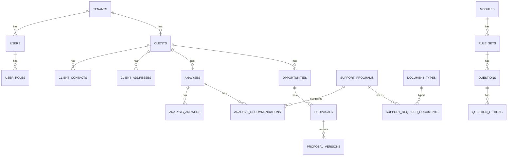

# CRM Entegre Platform - Esnek DB Tasarım Şablonu (Code First)

Bu model, one-to-many ve many-to-many ilişkileri güçlü şekilde yönetmek, yeni destek modüllerini hızlı eklemek ve geçmiş analizleri mevzuat değişse bile tutarlı saklamak için tasarlanmıştır.

## 1) Tasarım Prensipleri

- Her tabloda `TenantId` (multi-tenant)
- Her önemli tabloda `CreatedAtUtc`, `UpdatedAtUtc`, `CreatedBy`, `UpdatedBy`
- Rule/Question/Support metadata'da `Version`
- Soft delete gereken yerlerde `IsDeleted`
- Dış sistem eşleşmeleri için `ExternalSystem`, `ExternalId`

## 2) Çekirdek Tablolar

### Identity / Tenant
- `tenants`
- `users`
- `roles`
- `user_roles` (N-N)

### CRM Master Data
- `clients` (şirket/müvekkil ana kaydı)
- `client_contacts` (1-N)
- `client_addresses` (1-N)
- `client_tags` + `client_tag_map` (N-N)
- `client_external_refs` (CRM eşleşmeleri)

### Compliance Ops
- `compliance_cases`
- `compliance_tasks` (1-N)
- `compliance_task_assignments` (N-N)

### Eligibility Engine
- `modules` (SGK/KOSGEB/TÜBİTAK/Yatırım/Ticaret/...)
- `rule_sets` (modül + versiyon)
- `questions`
- `question_options` (1-N)
- `analyses`
- `analysis_answers` (1-N)
- `support_programs`
- `analysis_recommendations` (analysis N-N support_program)

### Proposal / Pipeline
- `opportunities`
- `opportunity_items` (hangi destekler önerildi)
- `proposals`
- `proposal_versions` (1-N)
- `proposal_approvals` (1-N)

### Document / Evidence
- `documents`
- `document_types`
- `analysis_documents` (N-N)
- `support_required_documents` (N-N)

### Integration & Events
- `integration_endpoints`
- `inbound_events`
- `outbox_messages`
- `sync_jobs`

## 3) Kritik İlişkiler

- `clients 1 -> N analyses`
- `analyses 1 -> N analysis_answers`
- `analyses N <-> N support_programs` via `analysis_recommendations`
- `support_programs N <-> N document_types` via `support_required_documents`
- `proposals 1 -> N proposal_versions`
- `compliance_tasks N <-> N users` via `compliance_task_assignments`

## 4) ERD (Mermaid)



## 5) Code First Entity İskeleti (Kısa)

```csharp
public class Client : BaseEntity
{
    public Guid TenantId { get; set; }
    public string Name { get; set; } = null!;
    public string TaxNumber { get; set; } = null!;
    public ICollection<Analysis> Analyses { get; set; } = new List<Analysis>();
}

public class Analysis : BaseEntity
{
    public Guid TenantId { get; set; }
    public Guid ClientId { get; set; }
    public Guid ModuleId { get; set; }
    public int RuleSetVersion { get; set; }
    public decimal SuitabilityScore { get; set; }

    public ICollection<AnalysisAnswer> Answers { get; set; } = new List<AnalysisAnswer>();
    public ICollection<AnalysisRecommendation> Recommendations { get; set; } = new List<AnalysisRecommendation>();
}

public class AnalysisRecommendation : BaseEntity
{
    public Guid AnalysisId { get; set; }
    public Guid SupportProgramId { get; set; }
    public string Status { get; set; } = null!; // UYGUN/POTANSİYEL/RİSKLİ
    public string RiskNote { get; set; } = null!;
}
```

## 6) Fluent Config (Örnek)

```csharp
builder.Entity<Client>()
    .HasIndex(x => new { x.TenantId, x.TaxNumber })
    .IsUnique();

builder.Entity<AnalysisAnswer>()
    .HasIndex(x => new { x.AnalysisId, x.QuestionId })
    .IsUnique();

builder.Entity<AnalysisRecommendation>()
    .HasIndex(x => new { x.AnalysisId, x.SupportProgramId })
    .IsUnique();
```

## 7) Index ve Performans

- `analyses (TenantId, ClientId, CreatedAtUtc DESC)`
- `analysis_recommendations (SupportProgramId, Status)`
- `clients (TenantId, Name)` full-text/trigram (PostgreSQL)
- `outbox_messages (Status, CreatedAtUtc)`

## 8) Versioning Stratejisi

- `rule_sets.version` immutable
- `analysis.rule_set_version` snapshot
- Böylece geçmiş analizler mevzuat değişse bile aynı sonuç bağlamında saklanır.

## 9) Integration Güvenliği

- `client_external_refs`: CRM mapping
- `inbound_events`: event hash + idempotency key
- `outbox_messages`: transactional publish

## 10) Migration Disiplini

```bash
# yeni migration
 dotnet ef migrations add AddOpportunityPipeline
 dotnet ef database update
```

Kurallar:
- Kırıcı rename yerine additive migration + backfill tercih edin.
- Nullable'dan non-null geçişte iki aşamalı migration uygulayın.
- Büyük tablolar için online index stratejisi planlayın.

## 11) Geleceğe Açık Genişleme

Yeni modül ekleme:
1. `modules` kaydı
2. `rule_sets/questions/support_programs` seed
3. Application seviyesinde evaluator ekle
4. UI modül registry kaydı

Bu modelle yeni modül eklemek çoğunlukla **yeni metadata + yeni evaluator** ile tamamlanır, çekirdek şema stabil kalır.
